[](https://mseep.ai/app/apisql-dev-apisql-mcp)

# apiSQL-MCP

[](https://www.npmjs.com/package/apisql-mcp)
[](https://opensource.org/licenses/MIT)
[](https://nodejs.org/)


[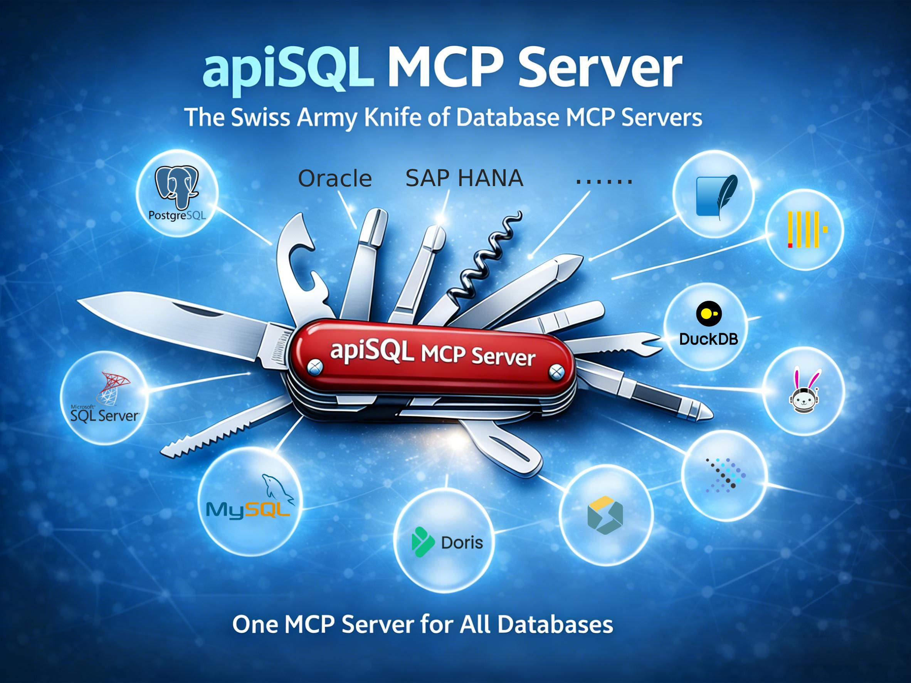](https://www.apisql.cn)


> 一个 MCP Server 连接所有数据库，数据库 MCP Server 的瑞士军刀。


## ✨ 功能特性

- **一个 MCP，连接多种数据库** —— 支持 MySQL、PostgreSQL、SQL Server、Oracle、SQLite、StarRocks、达梦、DuckDB、OceanBase、Trino、Presto 以及任何兼容 JDBC 的数据库
- **动态数据源切换** —— 无需重启 MCP 服务器，即可在运行时切换不同数据库
- **随时随地可访问** —— 通过apiSQL网关，轻松从互联网访问到内网数据库，需无内网穿透，无需公网IP、端口映射等繁杂配置
- **完整 SQL 支持** —— 支持 DDL 和 DML操作，执行存储过程和函数UDF。
- **安全和可观测性** —— 通过 apiSQL 平台提供APIkey授权、内置日志记录和审记。
- **多种传输模式** —— 支持 STDIO 和 Streamable HTTP 传输方式


## 🏗️ 整体架构说明


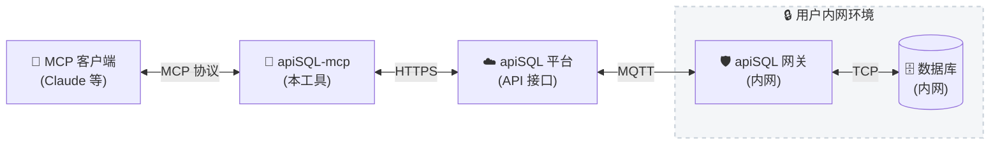

## 🗄️ 支持的数据库

| 数据库 | 类型 | 说明 |
|--------|------|------|
| MySQL / MariaDB | OLTP | 完整支持，包括存储过程 |
| PostgreSQL | OLTP | 完整支持，包括 JSON 操作 |
| SQL Server | OLTP | 支持 T-SQL |
| Oracle | OLTP | 支持 11g、12c、19c、20c+ |
| SQLite | 嵌入式 | 文件型数据库 |
| StarRocks | OLAP | 高性能分析型数据库 |
| Apache Doris | OLAP | 实时分析型数据库 |
| TiDB | 分布式 | MySQL 兼容的分布式 SQL |
| DuckDB | 分析型 | 进程内分析型数据库 |
| OceanBase | 分布式 | 分布式关系型数据库 |
| Trino / Presto | 查询引擎 | 联邦查询支持 |
| Dameng | 国产信创 | 达梦数据库 |
| 自定义 JDBC | 多种 | 任何 JDBC 兼容的数据库 |

## ⚠️ 安全提醒

**apiSQL-mcp 提供完整的数据库访问权限，包括结构修改和数据操作。请务必遵循以下安全准则：**

1. **最小权限原则**：
   - 创建具有最小所需权限的专用数据库用户
   - 生产环境使用只读访问权限
   - 通过视图限制对特定数据库/表的访问

2. **推荐配置**：
   - 从测试环境开始
   - 启用 apiSQL平台 的访问控制策略（IP 白名单、API Key）


## 🚀 快速开始

### 一分钟上手

1、以ChatBox配置为例： 设置 -> MCP
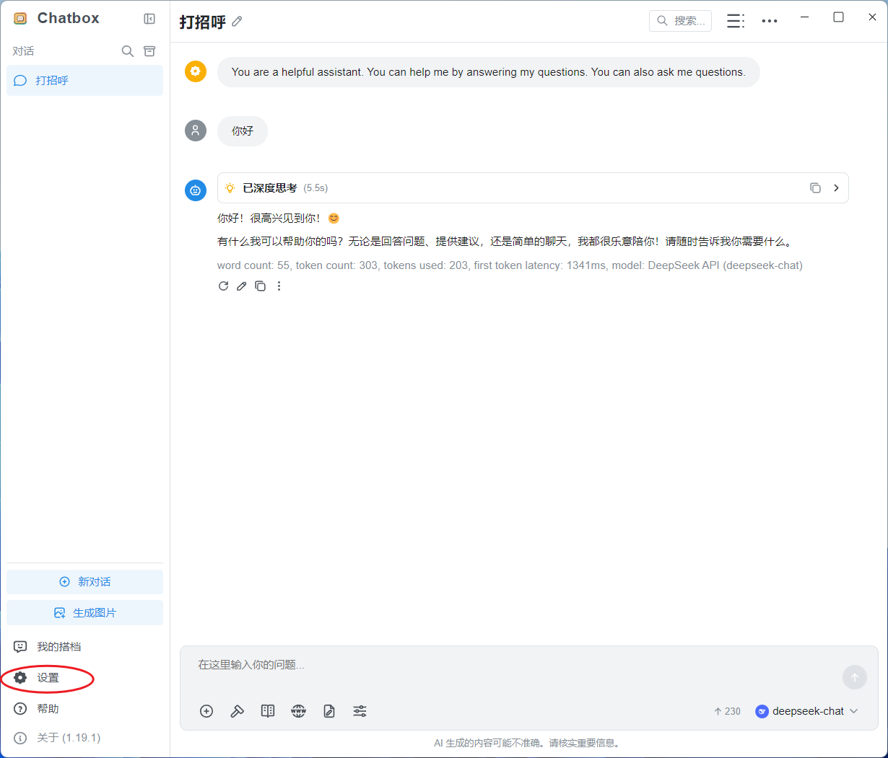


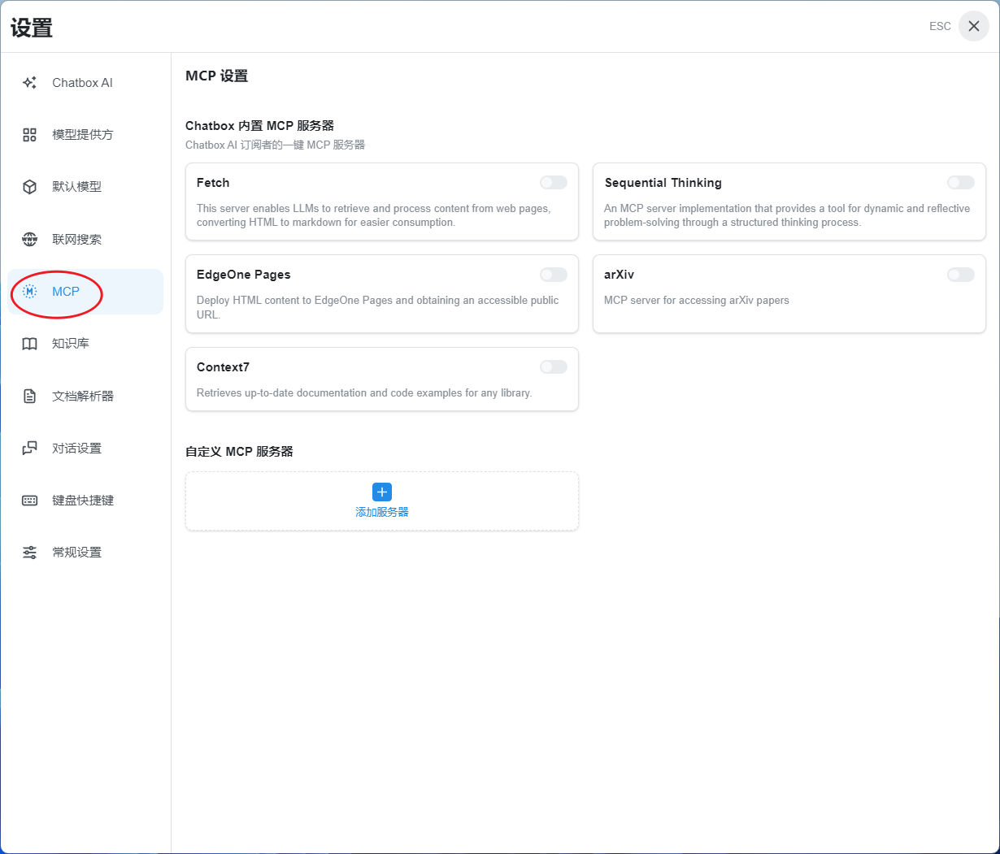

2、复制以下内容
```json
{
  "mcpServers": {
    "apisql-mcp": {
      "command": "npx",
      "args": ["-y", "apisql-mcp"],
      "env": {
        "APISQL_MCP_API_URL": "https://open.apisql.cn/api/mytest/$sudb",
        "APISQL_MCP_API_KEY": "Bearer sk-7dd9b66d38f8aff81f091ecfcf259f70",
        "APISQL_MCP_DS": "mysql"
      }
    }
  }
}
```

3、选择 从剪贴板中的josn导入，即可完成配置
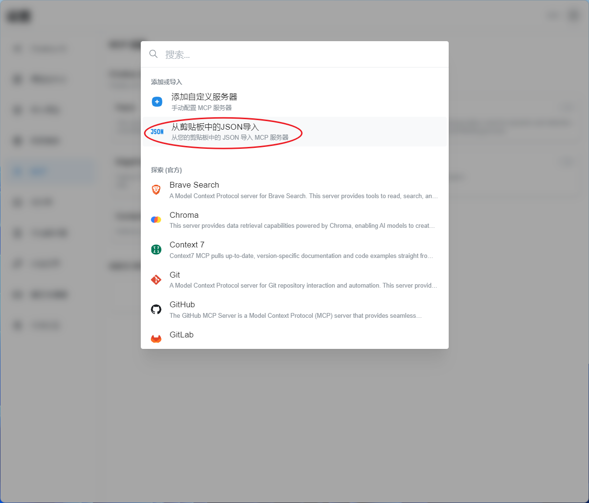


4、启用刚配置的MCP
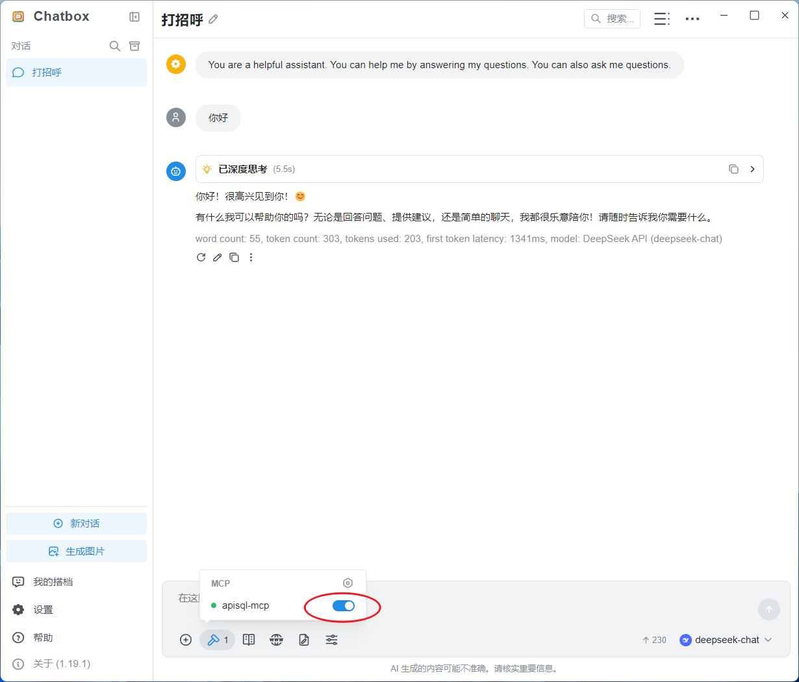


5、可以向默认的mysql数据库提问
```
 你帮看一下有没有DW开头的表？
```
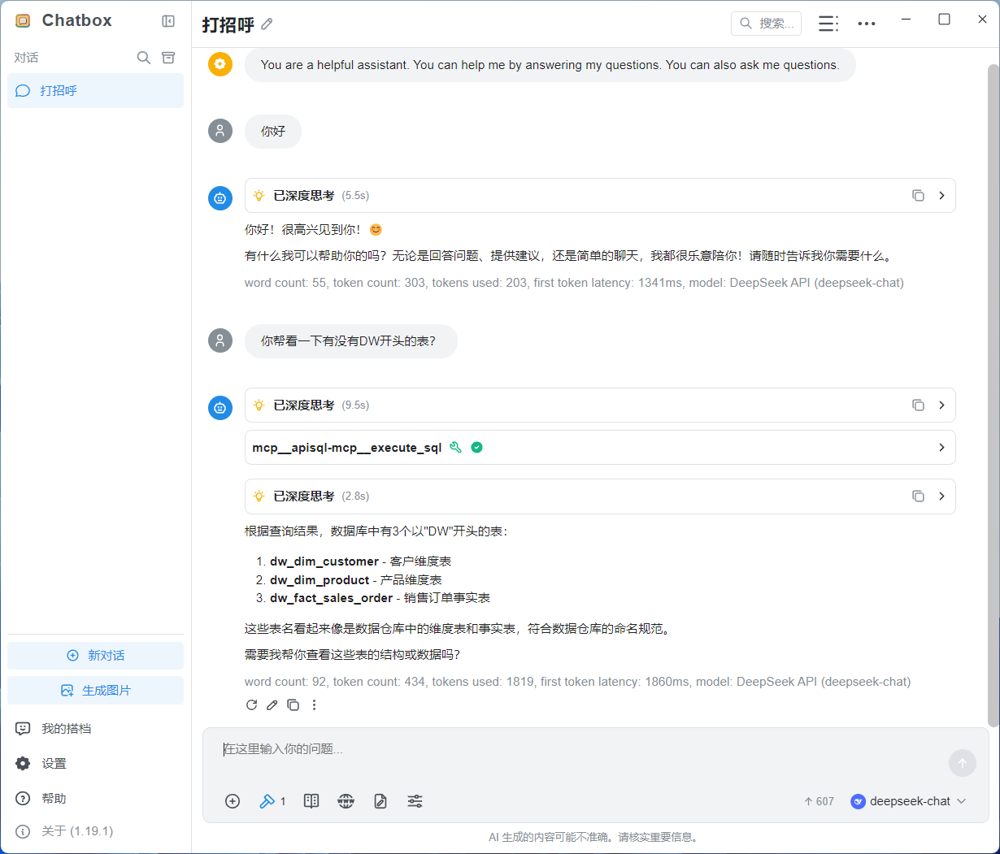


6、测试基于3张数据库，写个数据分析报告，运行中
```
你是数据分析师，你来分析一下这3张表，写一个简单的数据分析报告。
```


7、切换一个 oracle11g 操作
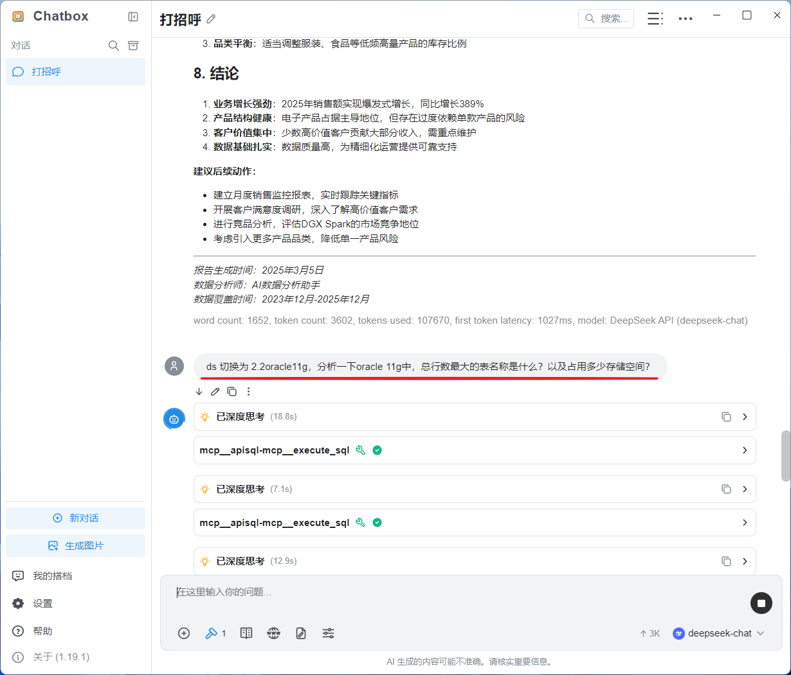


8、顺便解释一下，这里的oracle数据源是一个临时内网数据库，后续公开演示只有 mysql 和 postgresql 两个数据源）
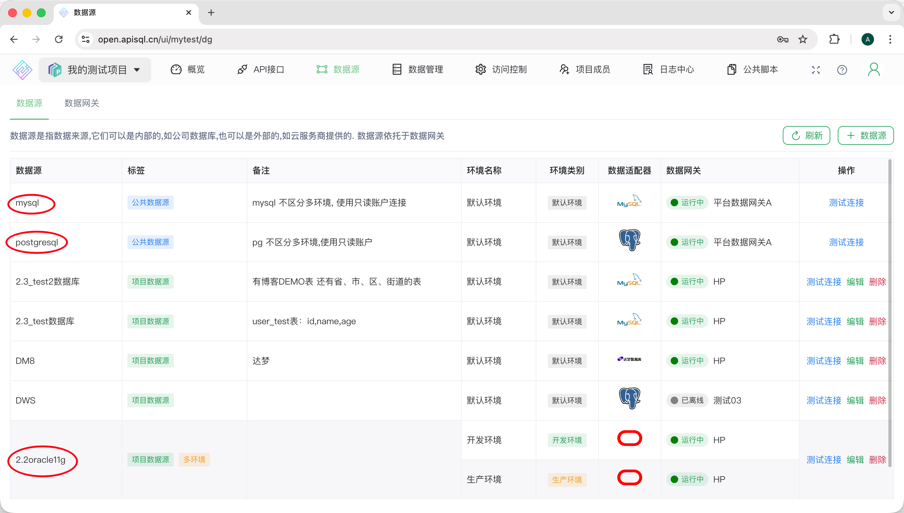


9、切换至postgresql进行sql操作
```
再切换到 postgresql 数据库，看一下都有什么表？
```
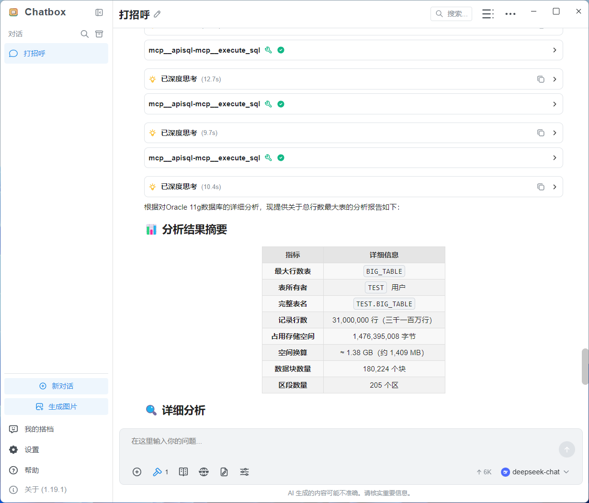


10、可以正常查询postgresql数据库

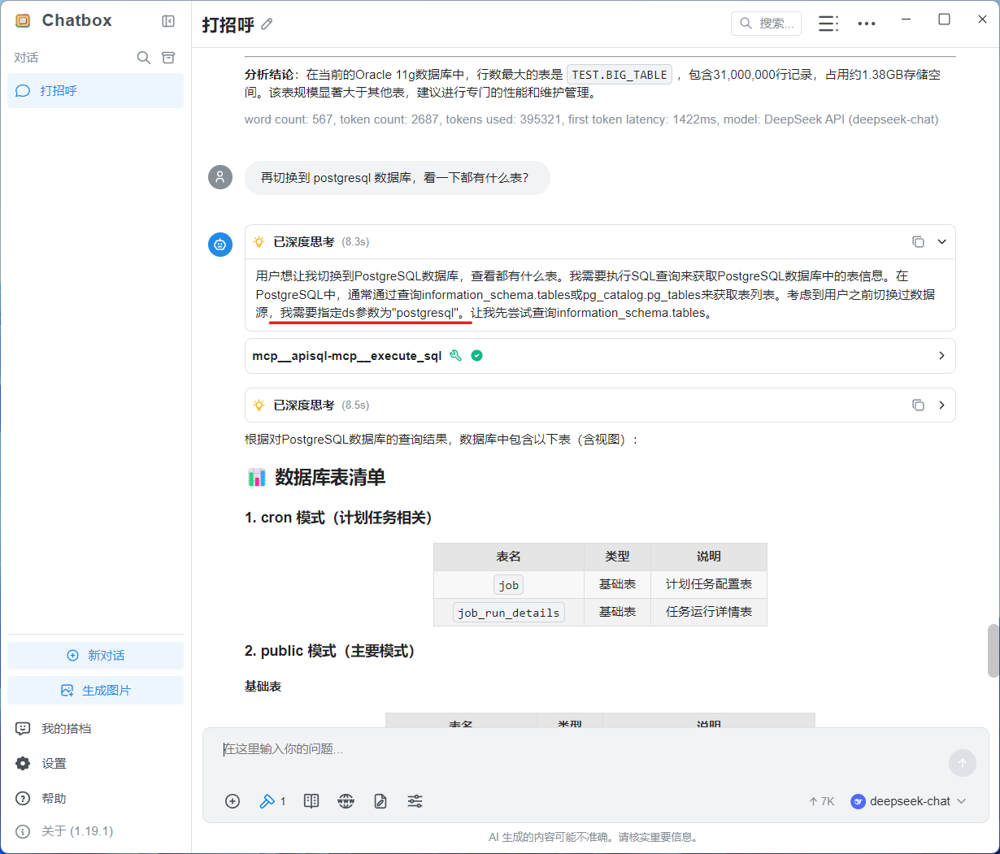


11、以及在apiSQL后台可以查看日志

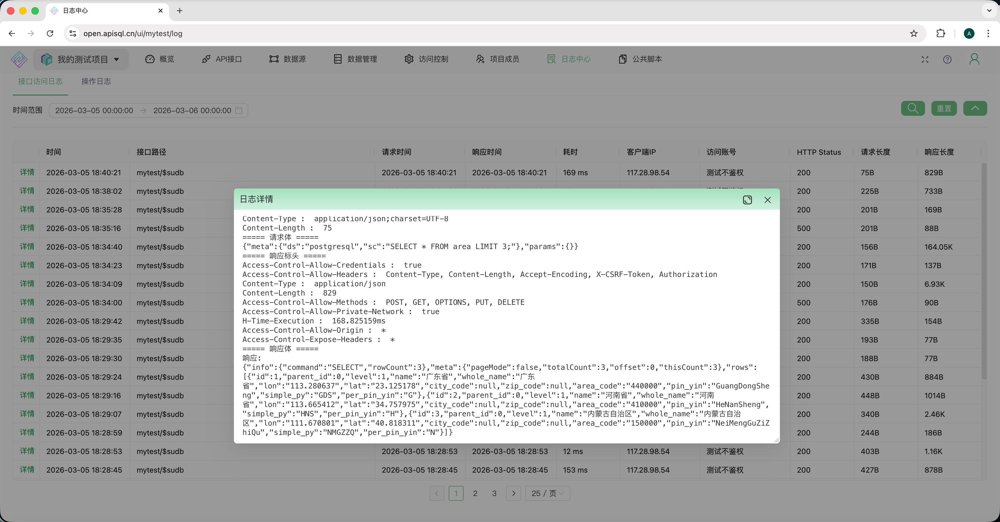

> 这样一个MCP Server，可以查询N个数据库。
> 在最佳实践中一般将数据源名称写入提示词，

### 接入自有数据库前提条件

- Node.js >= 18.0.0
- apiSQL 账号（在 [open.apisql.cn](https://open.apisql.cn) 注册）和 安装 [apiSQL网关](https://docs.apisql.cn/apisql/010@%E5%85%A5%E9%97%A8/020@%E5%BF%AB%E9%80%9F%E5%85%A5%E9%97%A8/readme.html) 连接数据库 

### 运行

```bash
# 全局安装（可选）
npm install -g apisql-mcp

# 或直接通过 npx 运行
npx -y apisql-mcp
```


### 配置

#### 环境变量

| 变量名 | 是否必需 | 说明 | 可测试的示例 |
|--------|----------|------|------|
| `APISQL_MCP_API_URL` | 是 | apiSQL API 端点地址 | `https://open.apisql.cn/api/mytest/$sudb` |
| `APISQL_MCP_API_KEY` | 是 | API 认证密钥（Bearer token） | `Bearer sk-7dd9b66d38f8aff81f091ecfcf259f70` |
| `APISQL_MCP_DS` | 否 | 默认数据源名称 | `mysql` |

#### 获取 API 凭证

1. 在 [open.apisql.cn](https://open.apisql.cn) 注册账号
2. 创建项目并安装数据网关
3. 将你的数据库添加为数据源
4. 在项目设置中启用 SUDB 功能
5. 创建访问控制策略，选择API Key 分配权限可访问SUDB
6. 从策略页面复制 API URL 和 Key

## 🔧 MCP 客户端配置示例

### Claude Desktop / Claude Code

将以下内容添加到 Claude Desktop 配置文件（macOS: `~/Library/Application Support/Claude/claude_desktop_config.json`，Windows: `%APPDATA%/Claude/claude_desktop_config.json`）：

```json
{
  "mcpServers": {
    "apisql-mcp": {
      "command": "npx",
      "args": ["-y", "apisql-mcp"],
      "env": {
        "APISQL_MCP_API_URL": "https://open.apisql.cn/api/mytest/$sudb",
        "APISQL_MCP_API_KEY": "Bearer sk-7dd9b66d38f8aff81f091ecfcf259f70",
        "APISQL_MCP_DS": "mysql"
      }
    }
  }
}
```

**使用 Claude Code CLI：**
```bash
claude mcp add apisql-mcp --scope user -- npx apisql-mcp
```

### Cursor

在 Cursor 设置 → MCP → 添加 MCP 服务器：

```json
{
  "name": "apisql-mcp",
  "command": "npx",
  "args": ["-y", "apisql-mcp"],
  "env": {
    "APISQL_MCP_API_URL": "https://open.apisql.cn/api/mytest/$sudb",
    "APISQL_MCP_API_KEY": "Bearer sk-7dd9b66d38f8aff81f091ecfcf259f70",
    "APISQL_MCP_DS": "mysql"
  }
}
```

### VS Code / Copilot

添加到 VS Code 的 `settings.json`：

```json
{
  "mcp": {
    "servers": {
      "apisql-mcp": {
        "command": "npx",
        "args": ["-y", "apisql-mcp"],
        "env": {
          "APISQL_MCP_API_URL": "https://open.apisql.cn/api/mytest/$sudb",
          "APISQL_MCP_API_KEY": "Bearer sk-7dd9b66d38f8aff81f091ecfcf259f70",
          "APISQL_MCP_DS": "mysql"
        }
      }
    }
  }
}
```

### Cline

添加到 Cline 的 MCP 设置：

```json
{
  "mcpServers": {
    "apisql-mcp": {
      "command": "npx",
      "args": ["-y", "apisql-mcp"],
      "env": {
        "APISQL_MCP_API_URL": "https://open.apisql.cn/api/mytest/$sudb",
        "APISQL_MCP_API_KEY": "Bearer 你的api-key",
        "APISQL_MCP_DS": "mysql"
      }
    }
  }
}
```

### Windsurf

添加到 `~/.codeium/windsurf/mcp_config.json`：

```json
{
  "mcpServers": {
    "apisql-mcp": {
      "command": "npx",
      "args": ["-y", "apisql-mcp"],
      "env": {
        "APISQL_MCP_API_URL": "https://open.apisql.cn/api/mytest/$sudb",
        "APISQL_MCP_API_KEY": "Bearer sk-7dd9b66d38f8aff81f091ecfcf259f70"
      }
    }
  }
}
```

### HTTP 传输模式（高级）

对于基于 HTTP 的 MCP 客户端，使用 Streamable HTTP 模式启动：

```bash
APISQL_MCP_API_URL=https://open.apisql.cn/api/mytest/$sudb \
APISQL_MCP_API_KEY="Bearer sk-7dd9b66d38f8aff81f091ecfcf259f70" \
APISQL_MCP_DS=mysql \
npx apisql-mcp --transport streamable-http --port 9090 --host 0.0.0.0
```

然后配置 MCP 客户端连接到：
```
http://localhost:9090/mcp
```

可用选项：
- `--transport <type>`：传输类型（`stdio` 或 `streamable-http`，默认：`stdio`）
- `--port <number>`：HTTP 服务器端口（默认：`9090`）
- `--host <host>`：HTTP 服务器主机（默认：`127.0.0.1`）

## 💡 使用示例

### 基础查询（使用默认数据源）

```json
{
  "name": "execute_sql",
  "arguments": {
    "sc": "SELECT * FROM user LIMIT 10"
  }
}
```

### 动态切换数据源

```json
// 查询 MySQL
{
  "name": "execute_sql",
  "arguments": {
    "sc": "SELECT * FROM orders WHERE status = 'pending'",
    "ds": "mysql"
  }
}

// 切换到 PostgreSQL
{
  "name": "execute_sql",
  "arguments": {
    "sc": "SELECT * FROM customers WHERE created_at > NOW() - INTERVAL '7 days'",
    "ds": "postgresql"
  }
}

// 切换到 Oracle
{
  "name": "execute_sql",
  "arguments": {
    "sc": "SELECT * FROM employees WHERE ROWNUM <= 10",
    "ds": "oracle"
  }
}
```

### 支持的 SQL 操作

- **查询**：`SELECT`、`WITH`（CTE）、`JOIN`、子查询
- **插入**：`INSERT INTO ... VALUES`、`INSERT INTO ... SELECT`
- **更新**：`UPDATE ... SET ... WHERE`
- **删除**：`DELETE FROM ... WHERE`
- **结构**：`CREATE TABLE`、`ALTER TABLE`、`DROP TABLE`、`CREATE INDEX`
- **存储过程**：执行存储过程和函数


## 🛠️ 开发指南

```bash
# 克隆仓库
git clone https://github.com/apisql-dev/apisql-mcp.git
cd apisql-mcp

# 安装依赖
npm install

# 编译 TypeScript
npm run build

# 开发模式（监听文件变化）
npm run dev

# 运行测试
npm test

# 启动服务器
npm start
```

## 🔍 故障排除

### "APISQL_MCP_API_URL environment variable is required"
- 确保正确设置了环境变量
- 检查 URL 是否以 `/$sudb` 结尾（SUDB 功能必需，固定地址，非变量）

### "API error: 数据源不存在"
- 验证数据源名称是否完全匹配（区分大小写）
- 确保数据源已创建且网关在线
- 对于多环境数据源，检查是否需要指定 `dsEnv`

### 连接问题
- 验证 apiSQL 网关是否运行并连接到平台
- 如果在本地运行网关，检查防火墙设置
- 确保 API Key 具有必要的权限

### 中文乱码问题
- 确保数据库连接字符集设置为 UTF-8
- 在 SQL 语句中使用 `SET NAMES utf8mb4`（MySQL）

## 📚 相关链接

- [apiSQL 官方文档](https://docs.apisql.cn)
- [apiSQL 云平台](https://open.apisql.cn)
- [问题反馈](https://github.com/apisql-dev/apisql-mcp/issues)
- [npm 包页面](https://www.npmjs.com/package/apisql-mcp)

## 📄 许可证

MIT © [apiSQL](https://www.apisql.cn)
